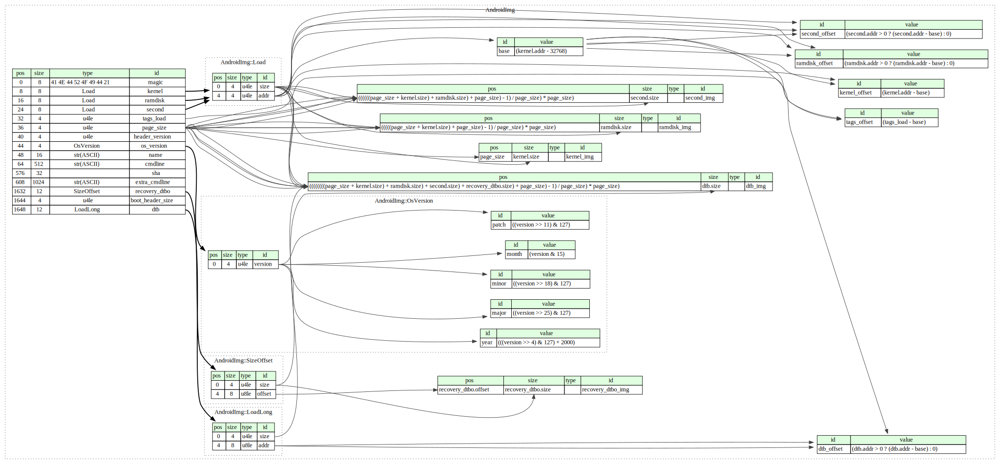

# Android Boot Image format

Info:
- format https://source.android.com/devices/bootloader/boot-image-header
- google parser https://android.googlesource.com/platform/system/core/+/refs/heads/android10-c2f2-release/mkbootimg/unpack_bootimg.py#45

